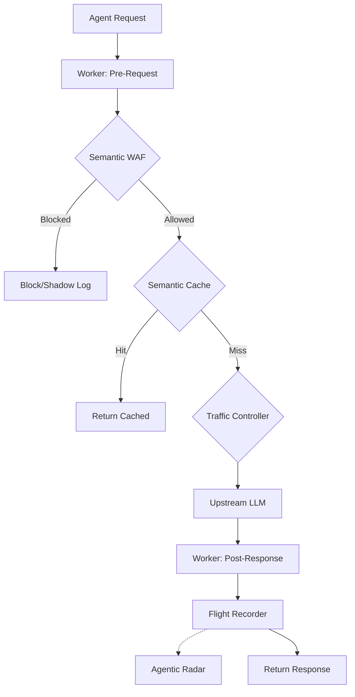

# Agent Switchboard

## 🚀 Quick Start

```bash
# Start all services
docker-compose up -d

# View logs
docker-compose logs -f proxy

# Open Mission Control Dashboard
open http://localhost:3000
```

## One-Line Integration

Change your `base_url` — that's it:

```python
from openai import OpenAI

client = OpenAI(
    api_key="sk-your-key",
    base_url="http://localhost:8080/v1",  # ← One line change
    default_headers={"X-Switchboard-Token": "demo_token_abc123"}
)

response = client.chat.completions.create(
    model="gpt-4",
    messages=[{"role": "user", "content": "Hello!"}]
)
```

## Architecture

## Architecture



## Features

### 🧠 Semantic CDN (New!)
- **Vector Caching**: Caches reasoning results using `pgvector` similarity search.
- **Zero-Latency**: Serves repeated queries in <20ms, saving money and time.
- **Local Embeddings**: Runs `all-MiniLM-L6-v2` locally (no external API costs).

### 🛡️ Semantic WAF & Firewall
- **WAF Rules**:
  - `WAF-101`: Prompt Injection detection
  - `WAF-102`: Tool Hijacking prevention
  - `WAF-103`: PII Exfiltration auto-redaction
- **Shadow Mode**: Test rules in production without blocking.
- **Fail-Open Design**: Ensures reliability even under load.

### 👷 Agent Workers (Edge Logic)
- **Programmable Proxy**: Inject custom JavaScript/TypeScript middleware.
- **Sandboxed Execution**: Runs untrusted code safely via Node.js `vm`.
- **Use Cases**: Custom PII masking, header injection, response transformation.

### 📡 Agentic Radar (Observability)
- **Anomaly Detection**: Real-time Z-Score analysis of token usage.
- **Fleet Health**: Detects runaway agents and hallucination spikes.
- **Live Alerts**: WebSocket broadcasts for critical anomalies.

### ✈️ Flight Recorder
- Full request/response logging
- Reasoning chain capture
- Cost calculation & burn rate tracking

### 🚦 Traffic Controller
- Multi-agent conflict resolution
- **Global Emergency Stop** (Kill Switch)
- Distributed locking via Redis

### 📊 Mission Control Dashboard
- Real-time metrics & anomaly visualization
- Policy governance & rule toggles
- Cache hit rate & savings monitor

## Services

| Service | Port | Description |
|---------|------|-------------|
| `proxy` | 8080 | Main proxy service |
| `dashboard` | 3000 | Mission Control UI |
| `redis` | 6379 | Cache & locking |
| `timescaledb` | 5432 | Trace storage |

## Development

```bash
# Install dependencies
npm install

# Run proxy in dev mode
cd services/proxy && npm run dev

# Run dashboard in dev mode
cd services/dashboard && npm run dev

# Run tests
npm test
```

## Environment Variables

| Variable | Default | Description |
|----------|---------|-------------|
| `PORT` | 8080 | Proxy port |
| `REDIS_URL` | redis://localhost:6379 | Redis connection |
| `TIMESCALE_URL` | postgres://... | TimescaleDB connection |
| `UPSTREAM_OPENAI` | https://api.openai.com | OpenAI upstream |

## API Endpoints

### Proxy (mirrors OpenAI API)
- `POST /v1/chat/completions`
- `POST /v1/embeddings`
- `GET /v1/models`

### Internal API
### Internal API
- `GET /api/burn-rate/:orgId`
- `GET /api/agents/:orgId`
- `GET /api/traces/:orgId`
- `GET /api/cache-stats/:orgId` (New)
- `GET /api/waf/rules` (New)
- `PUT /api/waf/rules/:id` (New)
- `GET /api/radar/anomalies/:orgId` (New)
- `POST /api/control/pause-all`
- `POST /api/control/pause-agent`

## License

MIT
